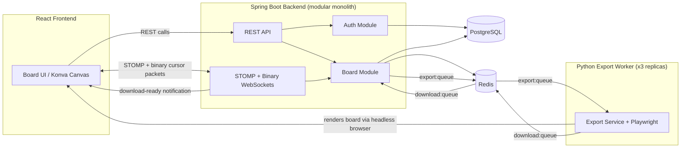
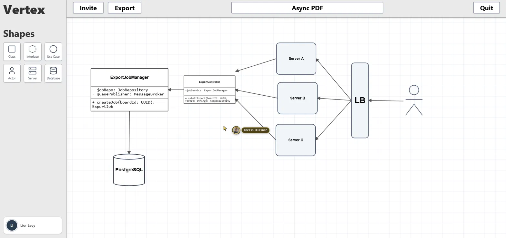
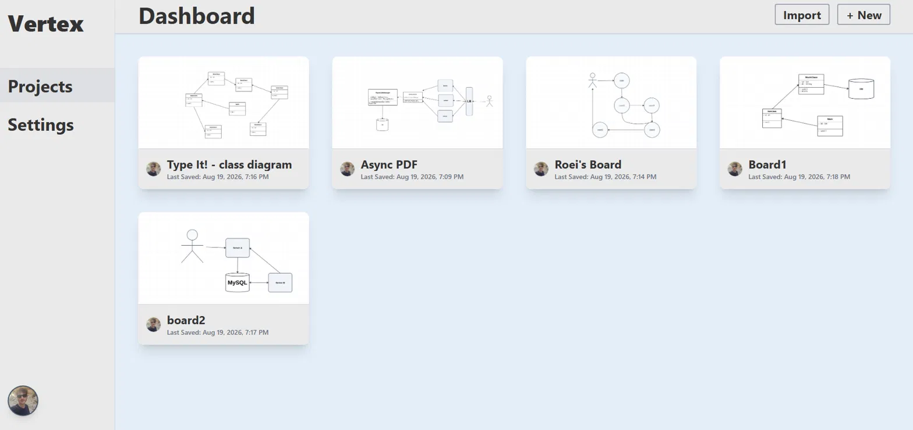
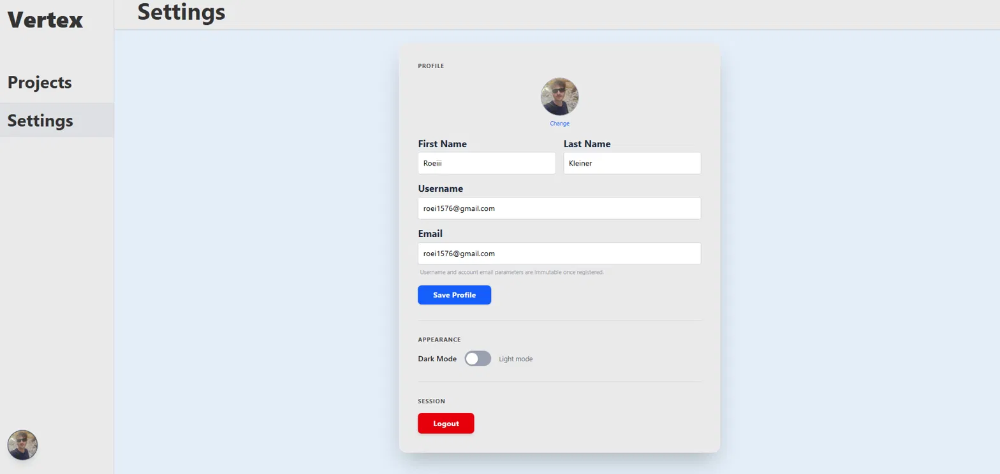
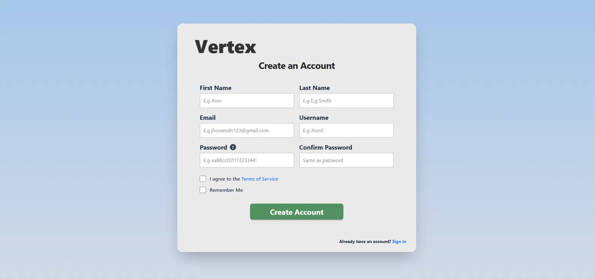
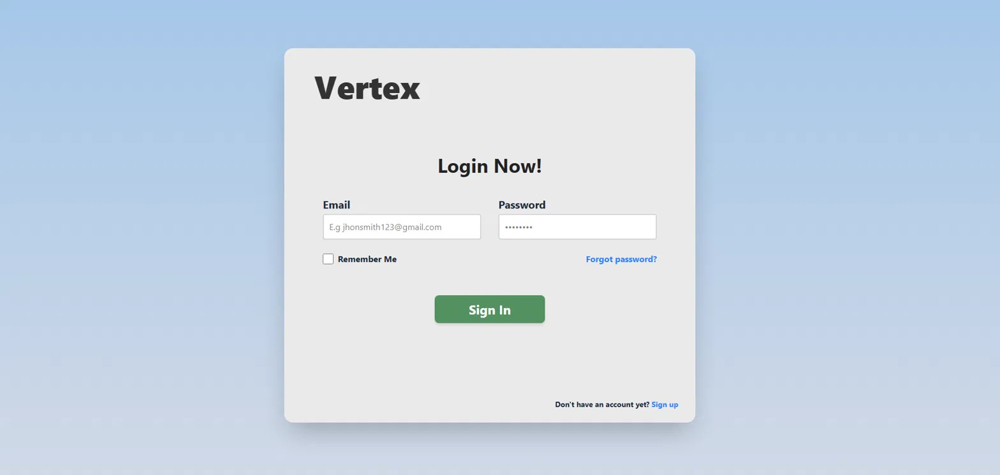

# Vertex

> **⚠️ Status: Early Development**
> Vertex is currently at ~90% completion of its first stable release. Core features are functional, but some minor bugs and rough edges remain. Not yet recommended for production use - feedback and issue reports are welcome.

**A real-time collaborative UML diagramming platform** - think Figma, but for system design and class diagrams. Multiple users can open the same board, drag components, draw relationships, and see each other's cursors move with sub-second latency, all while the state stays durable and recoverable.

This repository documents the full system: a Spring Boot backend, a React/Konva frontend, and a standalone Python export worker - three services with three different architectural jobs, each chosen deliberately rather than defaulted to.

---

## Table of Contents

- [What It Does](#what-it-does)
- [System Overview](#system-overview)
- [Why These Technologies](#why-these-technologies)
- [Backend Architecture](#backend-architecture)
- [Real-Time Collaboration Design](#real-time-collaboration-design)
- [Export Pipeline: A Separate Service](#export-pipeline-a-separate-service)
- [Is This Microservices?](#is-this-microservices)
- [Engineering Tradeoffs & Known Limitations](#engineering-tradeoffs--known-limitations)
- [Screenshots](#screenshots)
- [Running Locally](#running-locally)
- [Testing](#testing)

---

## What It Does

Vertex lets a team open a shared board and build UML diagrams together in real time:

- **Live multiplayer editing** - drag a class box, and every connected client sees it move immediately.
- **Live cursors** - every collaborator's cursor is visible, labeled, and moving in near-real time.
- **Shape library** - classes, interfaces, use cases, actors, servers, and databases, each with editable fields (attributes, methods, relationships).
- **Board import/export** - export a board as a PDF, a ZIP of images, or a custom `.vertex` archive that preserves the full editable scene graph for re-import.
- **Authenticated accounts** - email/password registration with verification, JWT-based sessions, and per-user board ownership.

The interesting engineering problem isn't the UI - it's making concurrent, high-frequency, multi-user state changes feel instant without corrupting the underlying data or overloading the database.

---

## System Overview

Vertex is three independently deployable pieces that together behave like one product:



**Why this shape, and not one monolith or a full microservice mesh?** Auth and board collaboration share data models, transactions, and deployment cadence - splitting them into separate services would add network calls and operational overhead for no real benefit at this scale. The export worker is different: it does CPU/browser-heavy work with a completely different scaling profile (spin up more Chromium instances under load) and a different failure domain (a crashed browser shouldn't take down the API). So it's the one component pulled out - not because "microservices are best practice," but because it's the one place the tradeoff actually pays for itself.

---

## Why These Technologies

Every choice below was made to solve a specific problem this project actually has, not because it's trendy.

| Technology | Why it's here |
|---|---|
| **Java 21 + Spring Boot 3.2** | Virtual threads make blocking I/O (JPA queries, scheduled persistence jobs) cheap to run concurrently without hand-rolled async plumbing. Spring's ecosystem (Security, WebSockets, Data JPA, Validation) covers auth, real-time transport, and persistence with mature, well-documented primitives - important for a solo-built project that still needs to be production-credible. |
| **PostgreSQL** | The system needs a durable source of truth for users, boards, and tokens that survives restarts and supports relational integrity (a board belongs to a user; a refresh token belongs to a session). Redis is fast but not meant to be your only copy of the data. |
| **Redis** | Two very different jobs, one tool: (1) a low-latency cache for "what does this board look like right now" so the API doesn't hit Postgres on every cursor twitch, and (2) a message queue (`export:queue` / `download:queue`) decoupling the API from the export worker. Using Redis for both avoids introducing a second piece of infrastructure just for queuing. |
| **STOMP over WebSockets** | Board sync, transforms, and download notifications are structured, addressable messages (subscribe to `/topic/board/{id}`). STOMP gives that structure for free instead of hand-rolling a message envelope over raw WebSockets. |
| **Raw binary WebSockets (for cursors only)** | Cursor position is the highest-frequency, lowest-value-per-message data in the system - dozens of updates per second, per user. A fixed 12-byte binary packet is dramatically cheaper to serialize and transmit than a JSON envelope, and this is the one place in the app where that difference is actually visible to the user as latency. |
| **Spring Security + JJWT (stateless JWT auth)** | The API is consumed by a decoupled frontend and needs to scale horizontally without sticky sessions. Stateless JWTs mean any backend instance can validate a request without shared session state. |
| **Python + Playwright + Chromium** | The export worker's job is to reproduce *exactly* what the user sees on a canvas-rendered board - the most faithful way to do that is to actually render the real frontend in a real browser rather than reimplementing the rendering logic twice in two languages. |
| **ReportLab / Pillow / zipfile** | PDF generation, aspect-ratio-preserving image scaling, and archive packaging for the three export formats - each is a narrow, well-scoped library for a narrow job rather than a heavyweight framework. |
| **Docker Compose** | Coordinates a genuinely multi-process system (backend, 3 worker replicas, Postgres, Redis) with one command, which matters a lot when the whole point of the project is demonstrating that these pieces work together. |

---

## Backend Architecture

The Spring Boot backend is a **feature-oriented modular monolith** - one deployable Java process, organized by business capability rather than by technical layer:

```
modules.auth    → users, registration, login, JWTs, refresh tokens, email verification
modules.board   → boards, real-time collaboration, exports, downloads, cursor sync
core            → shared API response contracts, infrastructure configuration
```

This keeps each capability's controller, service, repository, and model together instead of scattering them across global `controllers/`, `services/`, `repositories/` folders - a codebase organized this way stays navigable as it grows, because a change to "boards" touches one folder, not four.

**Authentication flow:**
1. Registration stores a BCrypt-hashed password; the account starts **locked**.
2. A verification token is persisted and emailed via Mailtrap; verifying it unlocks the account.
3. Login runs through Spring Security's `AuthenticationManager`, issuing a short-lived JWT plus a persisted refresh token.
4. `JwtAuthenticationFilter` validates the Bearer token on every request; `SecurityConfig` disables server-side sessions, keeping the API fully stateless.

**REST API**, versioned under `/api/v1`:
- `AuthController` - register, login, logout, email verification, profile updates
- `BoardController` - create/import/rename/delete/list boards, join a board room, request exports, retrieve cursor profiles
- `DownloadController` - authenticated file retrieval

All responses share a single `ApiResponse` envelope (status, message, payload, timestamp) so the frontend has one predictable shape to parse, and DTOs keep persistence entities from leaking into the public API contract.

---

## Real-Time Collaboration Design

This is the core engineering problem the project is built around: **how do you let many people edit the same object at once without hammering the database or losing state?**

**Normal sync path:**
1. Client calls `/join-room` → backend loads the board from PostgreSQL and warms Redis if needed → user is added to a Redis active-user set.
2. Client connects to `/ws`. Full board updates go through `/app/board/{boardToken}/sync`, broadcast immediately to `/topic/board/{boardToken}`.
3. Every update refreshes Redis (fast layer). PostgreSQL writes are **debounced** by a scheduled persistence job, not written on every event.

**Why debounce writes instead of persisting every change?** A drag operation alone can generate dozens of state updates per second. Writing each one to Postgres would add database load and latency that the user would actually feel, for durability the user doesn't need until they stop dragging. Redis absorbs the write-heavy hot path; Postgres only needs the settled result.

**Small updates (dragging a single shape)** go through a separate `/transform` channel that patches just the affected component instead of re-broadcasting and re-persisting the entire board - the cost of an update scales with the size of the change, not the size of the board.

**Cursor sharing** runs on its own raw binary WebSocket, deliberately separate from the STOMP channel used for board state, because it has a different frequency and cost profile (see the tech-choice table above). Redis Pub/Sub fans cursor events out across backend instances so cursors stay in sync even when users are connected to different replicas.

---

## Export Pipeline: A Separate Service

Exporting a board to PDF, ZIP, or the custom `.vertex` format is CPU-intensive and involves launching a real browser - work that shouldn't share a process (or a failure domain) with the request-serving API.

**Flow:**
1. The backend authenticates the export request and pushes a serialized job onto Redis (`export:queue`).
2. The Python worker (running as **3 independent replicas**, horizontally scaled by Docker Compose) blocks on `BLPOP`, picks up the job, and validates the requested format.
3. It opens the actual board in a headless Chromium instance, injects the requesting user's JWT into an **isolated browser context** (so no session state leaks between concurrent jobs), and waits for the canvas to render.
4. It reads the live scene graph, groups nearby nodes into visual clusters, and captures each cluster - this produces cleaner exports than a single full-canvas screenshot would.
5. A **Strategy pattern** (`ExportProcessor`) routes to the correct generator: image ZIP, PDF (via ReportLab), or `.vertex` metadata archive - so adding a new export format means writing one new strategy, not touching the orchestration logic.
6. The result is written to a shared Docker volume; a completion message goes onto `download:queue`.
7. The backend consumes that message, stores temporary download metadata in Redis, and pushes a real-time STOMP notification to the user - no polling required.

**Why not just generate exports synchronously inside an HTTP request?** Browser rendering can take seconds, which is a bad amount of time to hold an HTTP connection open. Queuing decouples the request lifecycle from the actual work, keeps the API responsive, and lets export throughput scale independently by adding worker replicas - which is exactly what the 3-replica Compose setup demonstrates.

---

## Is This Microservices?

**No - and that's a deliberate choice, not an omission.** The Java backend is a single Spring Boot process: one artifact, one deployment, shared memory and configuration between the auth and board modules. Splitting them further would add network hops and operational surface area without solving a real problem - they scale together, deploy together, and change together.

The **overall system**, though, is genuinely multi-process: the export worker is a separately deployed, independently scaled service that communicates with the backend only through Redis queues, never through direct calls or shared code. That's the one seam in the system that reflects a real difference in scaling and failure characteristics - which is the actual reason to draw a service boundary, rather than drawing one everywhere by default.

---

## Engineering Tradeoffs & Known Limitations

A project is more credible when it's honest about what it hasn't solved yet. Documented, in-progress items:

- **STOMP broker is process-local.** Redis distributes cursor events and queue messages across instances, but ordinary STOMP topic subscriptions currently are not externally brokered - a production deployment with multiple backend replicas would need an external broker (e.g., RabbitMQ) for board-sync messages to fan out correctly.
- **`BoardProfileRegistry` is in-memory**, so cursor profile data is local to a single JVM and can be inconsistent across backend replicas.
- **`/sync-cursor` uses query-parameter identity** rather than the standard auth header path - flagged for a follow-up security review.
- **`TokenCacheService` is scaffolded but unfinished** - JWT validation currently goes through the normal security path rather than a cache, which is correct but not yet optimal.
- **`spring.jpa.hibernate.ddl-auto=update`** is a development convenience; a production rollout would move to versioned migrations (Flyway/Liquibase).
- **Export queue is at-most-once, not guaranteed delivery.** `BLPOP` removes a job before processing completes, so a worker crash mid-export loses that job with no retry or dead-letter queue. This is a deliberate simplicity tradeoff for a v1, with a clear next step (an ack/requeue pattern) if reliability requirements tighten.

---

## Screenshots







---

## Running Locally

```bash
# clone all three repositories (backend, frontend, export worker)
git clone https://github.com/RkeyDev/vertex_backend.git
git clone https://github.com/RkeyDev/vertex_client.git
git clone https://github.com/RkeyDev/vertex_export_worker.git

# spin up the full stack (backend, 3 export-worker replicas, Postgres, Redis)
docker compose up --build
```

The backend expects a `.env` / `application.properties` with PostgreSQL, Redis, JWT secret, and Mailtrap credentials configured. See each repository for its specific environment variables.

---

## Testing

The backend test suite covers authentication, board services, controllers, queue integration, caching, persistence scheduling, downloads, and cursor handling, run via `./mvnw test`.

The export worker's suite (Pytest) covers request parsing, format routing, export strategies, and screenshot logic using mocked Redis, Playwright, and filesystem I/O - it does not yet exercise real Redis, real Chromium, or full end-to-end delivery, which is the natural next layer of test coverage.

---

*Built by [Roei](https://github.com/RkeyDev) as a portfolio project focused on distributed systems and backend architecture.*
